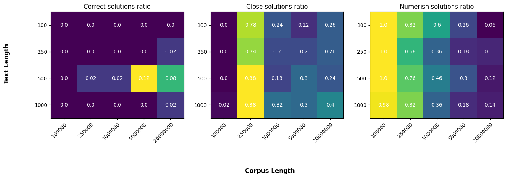
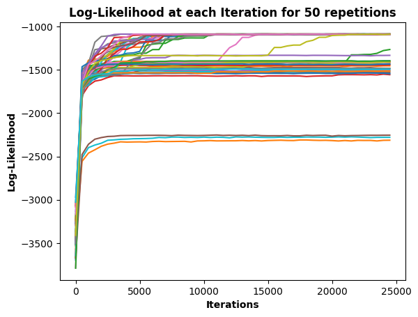
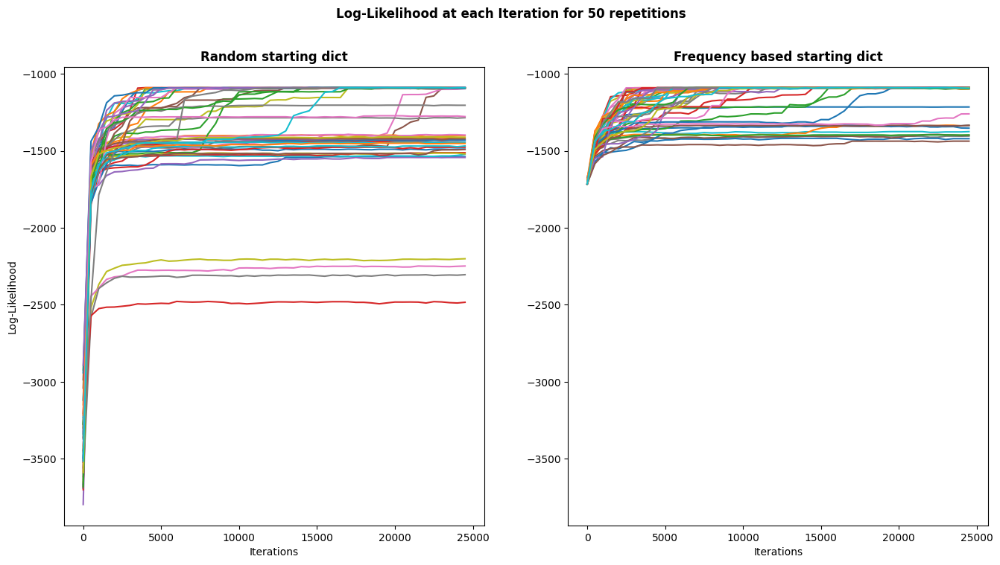
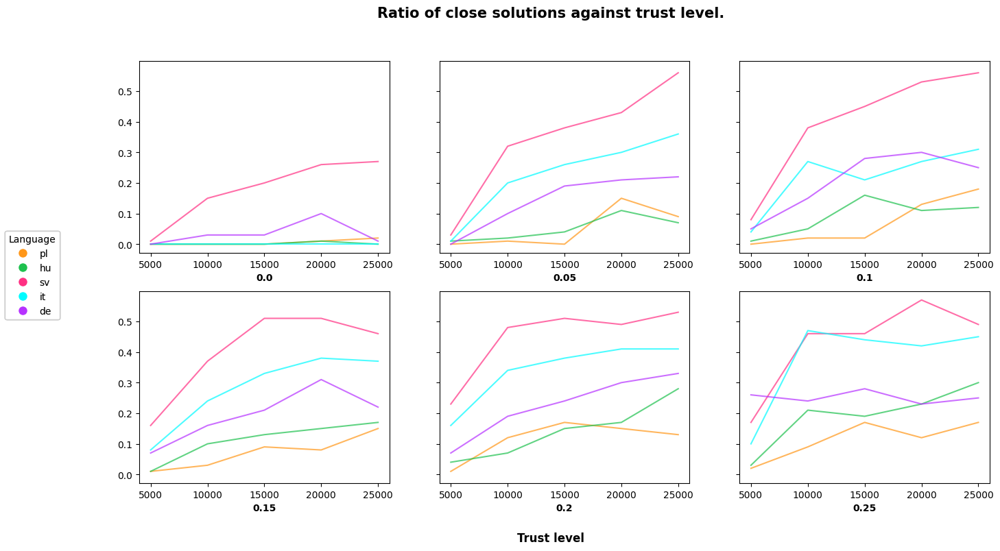

# MCMC Decipher

An exploration of using Monte Carlo Markov Chain (MCMC) methods to break substitution ciphers - a classic encryption technique where each letter is replaced with another. This project demonstrates how probabilistic modeling and MCMC sampling can be applied to decrypt encoded text by learning likely letter mappings based on language patterns. For the introduction to the project we recommend to read this <a href="https://medium.com/data-science/breaking-the-enigma-code-in-python-with-mcmc-marvel-themed-9ceb358dd8ae">article</a> by Jack J on Medium.

## Introduction
### Problem

We are facing the problem of deciphering a message encoded with substitution cipher, where each letter from the alphabet is replaced with another one from the same alphabet. Although the method is straightforward to implement, decrypting a message is not trivial. The core difficulty is the number of possible encryption keys which is the number of possible alphabet's permutations. For example English alphabet has 26 letters, which gives 26! potential keys (over 4&middot;1026 ). If we also consider numbers and punctuation we get 43 characters. This gives us 43! potential keys! This makes brute force approach infeasible.

### Goal

Our goal is to retrieve the original message in a sensible time. We are also searching for solutions that are close to the original message in a way one can understand them easily.

### Core Idea

We start off with a given <b>encrypted message</b> and assume the probabilities

$$\mathbb{P}(t_1 \rightarrow t_2)$$

are known for every pair of letters in a given alphabet. The expression in brackets means that letter t2 follows letter t1.

We define state space <b>S</b> of all possible messages created from initial encrypted message by changing the encryption key.
  
<b><i>Example</b> 
Let initial message be <i>"Connecticut"</i>. <i>"Bittebprblp"</i> is an allowed state, <i>"Tcdpetdhbss"</i> is not allowed.</i>
  
<b><i>Observation</b> 
Each state in <b>S</b> is unambiguously identified by an alphabet permutation (encryption key).</i> 
  
We define a probability distribution <b>&#960;</b> on <b>S</b> according to probabilities mentioned above. We use Metropolis-Hastings algorithm and after many iterations we get a sample from the distribution <b>&#960;</b> (more details in the next section).

#### Intuition

Since distribution <b>&#960;</b> is very closely linked to a real language it is very non-uniform. Obviously texts that resemble real language are more probable than gibberish. That is why we will land in the most probable solutions much more often. We hope that the most probable texts are close to the correct message.

### Approach

<b><i>Ergodic Theorem</b> 
Assume state space <b>S</b> is countable. Let (Xn)n&#8805;0 be an irreducible, aperiodic Markov Chain on <b>S</b> with stationary distribution <b>&#960;</b> and transition matrix <b>P</b>. Then <b>&#960;</b> is the only stationary distribution and
</i>

 

$$\forall_{i, j \in S} \; \lim_{n \to \infty}p_n(i, j) = \pi _j > 0.$$

#### Metropolis-Hastings algorithm

We already defined our state space. The distribution <b>&#960;</b> is naturally given by

$$\pi_t=\prod_{n=1}^{N-1}\mathbb{P}(t_n \rightarrow t_{n+1})$$

The sequence t = (tn) corresponds to the text of length N.

 

<b><i>Remark</b> 
This distribution may need to be normalized so that it truly is a distribution but for algorithmic purposes it does not matter and the interpretation from the previous section is still valid.</i>
  
Let us now associate states from <b>S</b> with encrypting keys. We move uniformly from state <b>i</b> to state <b>j</b> if <b>j</b> was made from <b>i</b> by swaping two keys. Let <b>Q</b> be the state matrix of that chain. Note that this chain is <b>irreducible</b>.
  

Define the <b>acceptace function</b>

$$a_{ij} := \frac{\pi_j q_{ji}}{\pi_i q_{ij}} = \frac{\pi_j}{\pi_i}$$

for such states <b>i</b>, <b>j</b> that the denominator is non-zero.
  
Note that the second equality comes from the fact that all non-zero elements from matrix <b>Q</b> are equal.
  
We create a new Markov chain, let's call it MHMC (Metropolis-Hastings Markov Chain). Assume we are in state <b>i</b>, we propose state <b>j</b> according to <b>Q</b>. If the acceptance function is greater than 1 we accept the state, otherwise we accept the state with probability equal to acceptance function. 
  
<b><i>Theorem 1</b> 
The MHMC is aperiodic, irreducible and <b>&#960;</b> is it's stationary distribution.</i> 
  
<b><i>Theorem 2</b> 
If <b>P</b> is a trasition matrix for Markov chain (Xn)n&#8805;0 and
</i>

$$ \exists_{\nu - probability \; distribution} \forall_{i, j \in S} \lim_{n \to \infty}p_n(i, j) = \nu _j$$

<i>then</i>

$$\forall_{\alpha - probability \; distribution} \; X_0 \sim \alpha \Rightarrow X_n \overset{d}{\rightarrow} \nu$$

  

Considering <b>Theorem 1</b>, <b>Theorem 2</b> and the <b>Ergodic Theorem</b> we get that no matter what state we start from we will get the sample from the stationary distribution <b>&#960;</b> (while approaching infinity). 
  
In practice we use log-probabilities instead of probabilities <b>&#960;</b>i. We do that to avoid multiplying a lot of small numbers (probabilities for letter transitions), instead we add logarithms of those probabilities.

## Exploration

In this section we discuss our studies on algorithm and probabilistic approach of decoding the crypted messages. We aim to identify limitations, characteristics and qualities depending on the factors such as message length, language corpus length, initial starting key and language group.

### 1. Quality of decryption regarding text length and corpus length

We analyzed how different message and corpus lengths impact the algorithm's performance. We examined combinations of text's lengths: 100, 250, 500, 1000 with corpus lengths equal to 100k, 250k, 1M, 5M, 20M.

 

For each encrypted message and corpus pair we ran default implementation of the algorithm 50 times recording how many times we got exact, close, and numeric solution. Below we define these metrics.  
<b>Exact</b> solution is a solution exactly matching the original, not encrypted message.  
<b>Close</b> solution is a solution whose likelihood score does not differ from original messages' score by given trust level. In our analysis we used trust level value equal to 0.1. We use this metric to measure how many times a readable solution was reached. We define a readable solution as one that a person can read and understand easily. 
<b>Numeric</b> solution is a solution with high content of numbers. We called a solution numeric if at least half of its characters were numbers. 

 

We visualise the results using three heatmaps that display the ratios of these solutions.

 

#### Observations

<ol>
<li>
 Correct solutions were almost never found despite using larger corpora. We can see that the biggest (20M characters) corpus got some stable correct solutions, but performance of 4 out of 50 attempts in the best scenario is very poor.
</li>
<li>
Bigger corpus yields better close solutions ratio with strange peak in corpus length of 250k. We will discuss it in the next section.
</li>
<li>
Numeric solutions ratio decreases with corpus length. For small corpora most of the found solutions were numeric while for the biggest corpus this ratio varies around 0.14.
</li>
</ol>

#### Close versus Numeric

We faced an anomaly of having tremendous ratio of close solutions for small corpus (250k). The intuition says that this metric should increase with corpus' size. The explanation is that not every close solution is actually close to the original message. Because by close we mean similar likelihood score we do not actually measure whether the solution is readable by a human. It turns out that for smaller corpora numeric solutions have better scores than original messages (see 100k characters corpus). The explanation of phenomena of having about 0.80 close solutions ratio for corpus of length 250k is that in this case original solution's score was similar to numeric solutions scores. We can see that we often ended in numeric solutions (with ratio about 0.78). For bigger corpora numeric solutions have lower score than the original message, so solutions classified as close are indeed easy to understand by a human. 

 

For example using the whole corpus, numeric solutions score fluctuated about -2282 while correct message score was -1089. Plot below presents the results of running algorithm 50 times for text of length about 500 characters and corpus of length 28M.

 

### 2. Frequency based initial decoding key

We were trying to improve the algorithm's performance by specifying starting encryption key instead of using a random one. If we were trying to decode the message without help of Monte Carlo methods we would probably find the most common letter in the deciphered text and substitute it with the most common letter in the language. We would do the same for second most common, third and so on. Here we made use of both heuristic and probabilistic approach.
  
For this approach to work we need a message that is long enough to contain letter frequencies structure similar to the language. In our study we used text of about 500 characters.
  
An image below presents the comparsion of each character frequency in the corpus and encoded message.

 

We can see very similar shape for both message and language corpus.
  
In this case we would run algorithm with starting encryption key presented in the table (character "_" means space).

 

|Letter     | _ | e | t | a | n | o | i | r | s | h | ... |
|:--------------|------|------|------|------|------|------|------|------|------|------|------|
|<b>Substitution</b> | l | s | , | 3 | 8 | 9 | j | r | m | . | ... |

 

When using default implementation, the one with random starting key, we sometimes ended in numeric solutions. It is a problem, because if we already are in such solution it is very difficult to leave it. That is because numbers are very likely to appear together and proposing change from number to letter is almost never accepted as it lowers the score the algorithm use to measure soultion's quality.
  
With frequency based approach we dramatically decrease chance of getting to such wrong solution as we start with probable one, the one that is not encoded to numbers (unless original message was numeric).
 

#### Results

Below we present the results of running algorithm 50 times with and without improvement.

 

We can see that initial log-likelihood score, here about -1700, is much better in the improved version. It is also bigger than numeric solution scores which in this experiment range from -2200 to -2600.
  
We also got much better ratio of close solutions (with trust level of 0.1). With random starting encryption key we've got <b>0.46</b> close solutions while with frequency based strategy this ratio increased by 0.30 reaching <b>0.76</b>. It means that, as humans, we were able to read and understand the decoded message three out of four times.

### 3. Quality of decryption depending on the language group

We thought it would be interesting to see if changing the language would influence the quality of decryption. We considered representatives of five different language groups.
  
<b>Considered languages</b>
<ol>
<li>Polish (Slavic)</li>
<li>Swedish (Scandinavian)</li>
<li>German (Germanic)</li>
<li>Italian (Romance)</li>
<li>Hungarian (Finno-Ugric)</li>
</ol>

We created the corpora for these languages by reading Wikipedia pages on various topic such as geography, music, politics etc. Then we created probability dictionaries based on fragments of the corpora of the same length. 

For this section we have to redefine what a close solution is.

A <b>close</b> solution is a solution that matches the original message letter by letter within a given trust level. A close solution with trust level equal to zero is an <b>exact</b> solution.

On the image below we can see how the ratio of close solutions depends on the number of iterations (time) of the algotithm. Each plot is made for a different trust level (in bold). Ratios were based on a 100 attempts.

The results are somewhat surprising. The algorithm seems to be working exceptionally well for Swedish. We can see that about 30% of solutions after 25000 iterations are exact matches and over 50% of solutions are a close match within trust level 0.05. We can assume that those messages are easy to understand even though not all of the letters match. We can see that in case of Swedish it does not get much better while increasing the trust level. That means that we either get a very close or a quite far solution.  

For Hungarian and Polish the algorithm was not very succesfull. Only about 10% of solutions were 95% close matches. Italian and German lie somwhere in the middle, Italian getting a bit better results.

There is one more thing that caught our eye. On the last plot, corresponding to the trust level 0.25, the purple line is almost horizontal (ratio equal to about 25%). That means that one in a four German solutions is a 75% match with the original message after at most 5000 iterations. Running the algorithm any longer doesn't increase the succes ratio.

#### Is it possible to decode a message not knowing the origin language?

During our analisys one final question arose. Is it possible to decode a message if we don't know what was the original language? Intuitively it wouldn't work but we decided to check it anyways.  

In order to achieve the correct inclusion of alphabets we tried to decode an English message using a random language (one of the languages mentioned above). 

It turns out that this approach <b>does not work</b>, even for German which is in the same languge group as English. We weren't able to reach a close enough solution with any of the previously mentioned languages.

Table below shows close solutions ratios for different trust levels. Ratios were based on a 100 attempts of decoding an English message according to German letter transition probabilities.

|Trust level     | 0.00 | 0.05 | 0.10 | 0.15 | 0.20 | 0.25 | 0.30 | 0.35 | 0.40 | 0.45 | 0.50 |
|:--------------|------|------|------|------|------|------|------|------|------|------|------|
| <b>Close Solution Ratio</b> | 0.00 | 0.00 | 0.00 | 0.00 | 0.00 | 0.00 | 0.00 | 0.00 | 0.01 | 0.01 | 0.03 |

### Sources
1. https://medium.com/data-science/breaking-the-enigma-code-in-python-with-mcmc-marvel-themed-9ceb358dd8ae
2. https://github.com/JackWillz/Projects/tree/master/MCMC%20-%20Enigma%20Thanos
3. dr hab. Wojciech Matysiak, <i>Procesy stochastyczne (lectures).</i> Faculty of Mathematics and Information Science, Warsaw University of Technology, 2024-2025.

[1]: https://medium.com/data-science/breaking-the-enigma-code-in-python-with-mcmc-marvel-themed-9ceb358dd8ae